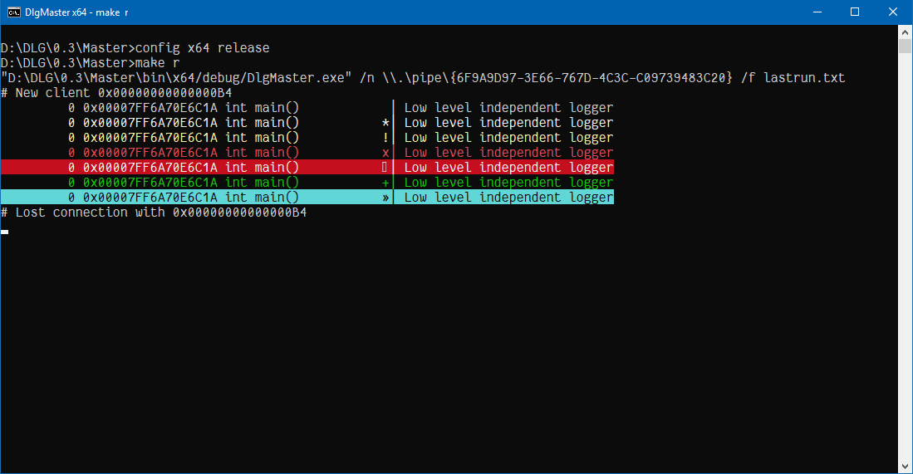

# DBG

Low level debug logger witch it doesn't use ".idata" or runtime libraries and that makes it perfect to be used with injected code

### Commands:
<pre>
  /?            help  
  /g            generate random pipe name
  /n {pipename} pipename, example: \\\\.\\PIPE\\{C05376A6-D8B9-4FDD-BD29-D5F27951166A}  
  /f {path}     logfle to write, if it doesn't exist will be created  
  /F {path}     logfile to append, if it doesn't exist will be created  
</pre>  
### Keybinds:
<pre>
  CTRL + C      exit  
  CTRL + L      clear  
</pre>
